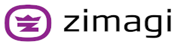

<p align="center">
  
</p>
<hr/>

<center><h1>Remote Classification Engine</h1></center>
<br/>

## Overview
<hr/>
<br/>

### What it is
<hr/>
<br/>

The Remote AI Zimagi module is a remote job classification and recommendation engine for helping administrators, particularly in the federal government, to understand if jobs could potentially be created as telework eligible.  This system has been created for and with the U.S. Department of the Interior for use in their Human Capital operations.

Combined with the Zimagi core platform this module creates an online API and processing engine that accomplishes five main tasks:

1. Source integration and data ETL
2. Feature engineering and management
3. AI model integration and management
4. Performance optimized prediction
5. Flexible data search and export

The primary goal of this platform is to create a simple modular platform that is fast to develop and test ideas, and capable of production deployment, in the time it takes to plan most prototypes.

<br/>

#### Source integration and data ETL

<br/>

This module depends on other Zimagi modules that provide jobs related models, source plugins, and import specifications.  Those import specifications are then orchestrated in module profiles defined in the **profiles** directory.

We implement a modular ETL system for integrating multiple job services into a common object model that separates the model definition, API interface, and the imports _(where related data models and API results meet)_.  This allows us to easily stitch data sources together and reuse the code we write to validate and transform the data that flows into our database.  These database imports can easily be scheduled in the Zimagi platform.

Modules can also define validators, formatters, and calculations _(which are derived values stored in the data model)_.  Models, imports, and calculations are defined in YAML files in the **spec** directory, while source plugins, validators, formatters, and calculation plugins are defined as Python classes in various **plugins** directories with corresponding specifications.

Zimagi does the hard work of **bringing all database models together** in a normalized and easily manageable form.  This provides the foundation for all other Zimagi capabilities.

<br/>

#### Feature engineering and management

<br/>

The Zimagi core imports normalized relational models from external data sources, such as APIs, files, and database connections.  To get data in a format we need for data analysis, the core provides a dataset data model and plugin, with current collection and period providers.

This system provides a powerful way to query data from across the data universe within Zimagi, including aggregated values.  We can apply **field_processor** providers and create new dynamic fields and apply **data_processor** providers across all of the joined data for operations, such as dropping duplicates.  Processor functions are just classes with a single **exec** method which transform the data.

We can then clean the intermediate fields we do not need in the final feature set.  In this platform all data modifications needed for model predictions are included in feature **profiles**.  There is **NO** data manipulation within the AI models themselves outside of splitting samples to provide for fully versioned data, which also speeds up model training because all needed data features are loaded.

All datasets are saved in the database and filesystem and can be grouped and queried.  All configurations used to generate the feature set are stored with the resulting feature set, ensuring we always understand what we are looking at.  Datasets in the system are then efficiently accessible through the API, as cached CSV file downloads.

Instead of generating a bunch of hard to understand SQL we use Object Relational Mapping and YAML definition to define feature profiles.  In the platform new dataset providers, field processors, and data processors can be defined and used with the feature profiles to extend them for unique needs.

Zimagi's goal is **No SQL** and **very little to no Python experience** needed to generate complex feature sets for data science analysis.

<br/>

#### AI model integration and management

<br/>

This **remote_ai** module builds off of Zimagi core capabilities _(plugins, datasets, commands)_ to provide a simple but robust and extensible AI integration platform that can learn over time as it serves recommendations.  This module provides model and prediction models, as well as a model data plugin with an initial TD-IDF Support Vector Classification provider.  It also provides a preprocessor **field_processor** provider, and various **profiles** for features and model management.

In this platform AI models are data records with a name, provider, groups, dataset _(generated features mentioned above)_, configurations like training_percentage, model performance statistics, and trained model storage on a shared filesystem.  They are searchable and can be managed over time via the Command API or Zimagi CLI.

When models are saved and given a dataset, they are trained on that dataset.  They are first trained on training and test samples to derive performance metrics, then trained on the complete feature population to serve predictions to users.  If anything changes with the model, it needs to be retrained.  If configurations, groups, model parameters, or the dataset changes then training will be automatically run on **remote model save**.  If the model code changes the save command will need to be run _(with no arguments except the name)_.

Models are created from providers which are swappable implementations that share a common interface for machine learning processing.  Defining these providers is easy because parent providers abstract standardized implementations.  The goal is for AI model providers to require as little code as possible, while keeping the AI model interface standardized to allow swappability.

AI model providers can be saved with **profiles** allowing their orchestration in complex command arrangements.  For instance, in the **models** profile we first import, then generate features, and save and train models.  We do this with one command; **run remote_ai models**.  We can then schedule this profile in the platform and have an easy version controlled process for updating models that requires very little administrative effort.

Model definitions, such as the **remote_ai_model** and **remote_ai_prediction**, and various workflow orchestration profiles are defined entirely through YAML specifications, while the module provides a new model plugin, initial provider, extra class libraries, and commands as simple Python classes.

<br/>

#### Performance optimized prediction

<br/>

The purpose of this module is to provide a recommendation engine that uses the AI models to predict based on input job text.  In these classification models we are using three standard metrics to track performance of the models we run; **precision**, **recall**, and **F1 score**.  By default we care more about a higher F1 score, but there are times where precision or recall might be more important.

The Zimagi remote_ai module implements a **remote predict** command that is available to end users to get targetted recommendations pertaining to remote classification of job descriptions.  This command can either accept a specific model name with which to predict against or it can find the best performing model based on a specific metric, like F1 score, and use that model to predict.

The self optimizing prediction system allows defined AI models to compete, with the best at any given time providing the ultimate prediction to the user.  With constant training on newly imported data through scheduling of updates, we can create an internal game that evolves as the data evolves.  Not only are the models learning, but the prediction is too.  This can help with model drift and allow us to experiment to get the best out of our predictions.

Ultimately the quality of the predictions are what matters most to users.

<br/>

#### Flexible data search and export

<br/>

At it's core Zimagi is a **data management system**, so it provides a lot of capabilities focused on data **integration**, **processing**, and **distribution**.  Zimagi extracts a robust collection of related models from all of the data import specifications discussed above.  It then makes this data available to us in a number of ways.

Zimagi provides a **self-documenting command API** that allows us to perform administrative actions and manage data in the system.  This API is a streaming RPC gateway, that accepts a POST request with parameters, and streams JSON messages back to the client until the command is complete or the user disconnects.  Every data model implements a standardized collection or subset of **list**, **get**, **save**, **remove**, and **clear** commands.  Commands can be easily added by modules like **remote_ai**.  For more information on the various commands, run **zimagi help** or any command with the **--help** option.  The Zimagi CLI is a local containerized runtime that allows local offline operation _(great for development)_ or a client for remote Zimagi command API servers.  The experience is the same.

Zimagi also provides a **self-documenting Open API compatible REST API** for accessing data models, that allows for a tree like linking of models across the system.  This can allow you to easily explore relationships between data, and supports a very powerful search interface.  It even supports aggregated fields.  For instance you can search for instances that have more than three groups _(COUNT)_.  All returned documents provide linkable references to pages and related model instances, so complex URL parsing is not necessary to get at the data needed.  It can even be done in the browser through clicking.

Through the REST API we can also access **independent field counts and values list endpoints**, which can be useful for interfaces that need to know available options or volume of data before performing a complex query.  This can also work with related fields.  For instance to query all of the group names for a given model field, we could do; https://localhost:5123/user/values/groups__name _(assumes Zimagi is running locally, which is covered later)_.

If we know exactly what fields we need, including from related models, then we can **pull a JSON or CSV dump of specific fields**.  These fields can link across related data models, allowing very comprehensive field lists across the Zimagi data universe.  This can be handy if the desire is to pull specific information from the database into another application or data science project _(CSV to dataframe)_.  This supports the same powerful query syntax as the REST data API.

Finally Zimagi can provide **fast cached CSV exports of all datasets in the system**.  This means that data scientists can work locally in notebooks with the same data that will be run in the production system without any real effort.  This is great for experimenting with new models or even providing spreadsheet data reports to stakeholders that need to be regularly updated.  We can put dataset generation on a schedule and always have the data we need on hand without any work required on our part.

<br/>

### Goals
<hr/>
<br/>


<br/>

### Limitations
<hr/>
<br/>

<br/>

### Technologies
<hr/>
<br/>

<p align="center">
  
</p>

<br/>

## Installation and setup
<hr/>
<br/>

#### SSL Certificates

<br/>

Before we get into the details of the deployment process we need to consider SSL certificates on the Zimagi Docker image.  **This is the very first thing you need to decide because the entire security of the platform is at stake.**

The official Zimagi container image ships with developer generated self-signed SSL certificates, which are located in a repository linked at the bottom of this document.  The certificates are only good for development in a secure environment.  If you want to run a secure remote web service you will want to replace these.  They are available as ARGS to the Dockerfile.  This means you need to generate a new Dockerfile with your SSL certificates.

This is particularly important with Zimagi because the platform uses a private key generated from the combination of certificate information as an AES-256 encryption key for storing encrypted information, parsing encrypted API tokens and parameters, and generating encrypted messages to clients.  This way only the same containers can talk to each other, and access to those container images can be tightly controlled.

For a secure web environment, we recommend creating a private Docker repository, or atleast a private Docker Hub account, and have a CI/CD system generate new re-keyed images from the official images as new tags are released.  We have an example project that works with our CI/CD provider, CircleCI, available on [GitHub](https://github.com/zimagi/build) _(also linked to at the bottom of this document)_.  If you use CircleCI and Docker Hub you can fork this repository and fill in some environment variables and the CI/CD platform will take over from there.

If you are an intermediate to advanced user of Docker you should have no problem rekeying the Zimagi Docker image with secure certificates.

It is important to remember that **only the Zimagi Docker images with the same SSL certificates can talk to each other by default** unless you disable the API encryption with environment variable **ZIMAGI_ENCRYPT_API**.

<br/>

_Example **Dockerfile**:_
```dockerfile
ARG ZIMAGI_VERSION=latest
FROM zimagi/zimagi:${ZIMAGI_VERSION}
#
#====================================================================
# OS environment configuration
#
ARG ZIMAGI_CA_KEY
ARG ZIMAGI_CA_CERT
ARG ZIMAGI_KEY
ARG ZIMAGI_CERT

RUN store-key /etc/ssl/private/zimagi-ca.key "${ZIMAGI_CA_KEY}"
RUN store-cert /usr/local/share/ca-certificates/zimagi-ca.crt "${ZIMAGI_CA_CERT}"
RUN update-ca-certificates

RUN store-key /etc/ssl/private/zimagi.key "${ZIMAGI_KEY}"
RUN store-cert /etc/ssl/certs/zimagi.crt "${ZIMAGI_CERT}"
```

<br/>

_Example Re-keyed Zimagi image deployment **shell script**:_

```bash
#!/usr/bin/env bash
#-------------------------------------------------------------------------------
set -e

ZIMAGI_BASE_REGISTRY="${ZIMAGI_BASE_REGISTRY:-registry.hub.docker.com}"
ZIMAGI_BASE_IMAGE="${ZIMAGI_BASE_IMAGE:-zimagi/zimagi}"

ZIMAGI_REGISTRY="${ZIMAGI_REGISTRY:-registry.hub.docker.com}"
#-------------------------------------------------------------------------------

echo "Fetching upstream Zimagi tags"
ZIMAGI_TAGS="$(wget -q "https://${ZIMAGI_BASE_REGISTRY}/v1/repositories/${ZIMAGI_BASE_IMAGE}/tags" -O - | sed -e 's/[][]//g' -e 's/"//g' -e 's/ //g' | tr '}' '\n' | awk -F: '{print $3}')"

echo "Logging into DockerHub"
echo "$ZIMAGI_REGISTRY_PASSWORD" | docker login --username "$ZIMAGI_REGISTRY_USER" --password-stdin "${ZIMAGI_REGISTRY}"

for TAG in $ZIMAGI_TAGS
do
    echo "Building Zimagi tag: ${TAG}"
    docker build \
        --build-arg ZIMAGI_VERSION="${TAG}" \
        --build-arg ZIMAGI_CA_KEY \
        --build-arg ZIMAGI_CA_CERT \
        --build-arg ZIMAGI_KEY \
        --build-arg ZIMAGI_CERT \
        --file "Dockerfile" \
        --tag "${ZIMAGI_REGISTRY}/${ZIMAGI_IMAGE}:${TAG}" .

    echo "Pushing Zimagi tag: ${TAG}"
    docker push "${ZIMAGI_REGISTRY}/${ZIMAGI_IMAGE}:${TAG}"
done
```

<br/>

### Local CLI tool
<hr/>
<br/>

<br/>

### Web platform
<hr/>
<br/>

The Zimagi platform is composed of four interconnected microservices, and depends on both relational and non-relational databases.

* **Data API** - Allow searchable data access through self-documenting REST API

* **Command API** - Provide a remote operating system for data processing

* **Scheduler** - Execute commands based on user defined schedules

* **Workers** - Run commands concurrently in the background

<br/>

The Zimagi platform depends on:

* **PostgreSQL / MySQL / SQLite3 Relational Database** - Used for storing all of the created and imported models and related platform data

* **Redis In-Memory NoSQL Data Store** - Used for queueing and caching

<br/>

_The diagram below illustrates how the pieces fit together:_

<p align="center">
  
</p>

<br/>

There are two primary and supported ways to launch the Zimagi web platform as a continuous web service.

We currently build on Docker containers and use Docker Compose to build single server platform hosting environments.  If you are looking to host a simple development instance and don't want to mess around with Kubernetes this is the way to go for small non high availability deployments, such as a prototype, module or core development, or just kicking the tires.

If you need more power for your deployment we package Zimagi up as a Helm chart for Kubernetes that can deploy everything needed in one shot as a fully functioning autoscalable cluster.  It can also connect up to dedicated databases like AWS RDS or ElasticCache.  If the Kubernetes cluster was built with high availability in mind then Zimagi can benefit from a self healing architecture that provides a fair amount of service high availability.

We are putting a lot of work into our autoscaling Kubernetes hosting architecture so there will be many improvements in this area.  Zmagi is designed for scalability and multi / hybrid cloud deployments.

In each hosting scenario mentioned above Zimagi tries to make the deployment process painless, as you will see in the following instructions.  **If you venture outside the realm of Docker Compose or Kubernetes and Helm, we can try to answer questions, but those hosting architectures are not supported by the core development team.**

<br/>

<br/>

#### Docker Compose deployment

<br/>

If you need a single server deployment of Zimagi Docker Compose can come in handy.  If you spin up Docker, setup Docker Compose on the server, you have an easy way of managing interconnected services on the same machine.  All core Zimagi development work is done in these environments, and they can be a cost effective way to launch a Zimagi platform quickly and easily.

Local host machine

Vagrant virtual machine

Single server

<br/>

#### Kubernetes Helm deployment

<br/>

## Usage
<hr/>
<br/>

<br/>

### User types and flow
<hr/>
<p align="center">
  
</p>
<br/>

<br/>

### Administrators
<hr/>
<br/>

<br/>

### Software Engineers
<hr/>
<br/>

<br/>

### Data Scientists
<hr/>
<br/>

<br/>

### Users
<hr/>
<br/>

<br/>

## Credits
<hr/>
<br/>

<br/>

## License
<hr/>
<br/>

<br/>

## Related Projects
<hr/>
<br/>

| Zimagi Link | Description |
| :------------------- | :------------------------------------------ |
| [**Core**](https://github.com/zimagi/zimagi) | The GitHub repository for the Zimagi core platform upon which this module runs |
| [**Documentation**](https://docs.zimagi.com) | Zimagi documentation site for core platform (_work in progress_) |
| [**Docker Hub Project**](https://hub.docker.com/r/zimagi/zimagi) | Base Zimagi Docker images (**_docker pull zimagi/zimagi:latest_**) |
| [**Default Certificates**](https://github.com/zimagi/certificates) | Default (_non-secure_) SSL certificates packaged with the official container |
| [**Rekeyed Docker Builds**](https://github.com/zimagi/build) | GitHub repository with example code for rekeying a ZImagi Docker image with secure certificates |
| [**Python Pip Project**](https://pypi.org/project/zimagi/) | Official PyPI project for the Zimagi CLI (**_pip install zimagi_**) |
| [**Helm Repository**](https://charts.zimagi.com) | Official Kubernetes Helm charts for Zimagi projects (**_helm repo add zimagi https://charts.zimagi.com_**) |

<br/>

| Required Zimagi Module | Description |
| :------------------- | :------------------------- |
| [**Jobs**](https://github.com/Polydelta-ai/zimagi-jobs) | This Zimagi module provides base job models that other modules can extend with fields that are possibly relevant across job boards |
| [**USA Jobs**](https://github.com/Polydelta-ai/zimagi-usa-jobs) | This Zimagi module extends the **Jobs** module and adds federal government related job fields, as well as data plugins and ETL imports from the USAJobs API |
